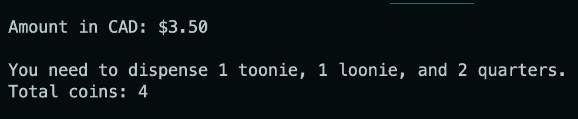

## Cashmoney - DEV

*Cashmoney* is a command-line program that calculates the minimum number of coins required to give a user change. This program takes in a user inputted dollar amount, calculates, and then outputs the accurate number of Toonies, Loonies, Quarters, Dimes, and Nickels. Cashmoney follows a `greedy algorithm`, meaning that the program will "take the biggest bite" out of the problem it can every time. So it'll dispense Toonies first, until it is no longer divisible, then move on to Loonies, Quarters, so on and so forth. Additional iterations of this project also included the option to change currency types.

This project was separated into two main parts.
- Part 1: Develop the program within a single `getChange` function.
- Part 2: Separate components of the function into `Classes`, to practice Object Oriented Programming.

Example:
User inputs CAD conversion with `3.52` as the amount. Program outputs change in coins.

### Links
- [Cashmoney Repository](https://github.com/DevDegree/dev-cashmoney-scottzyang) (Internal to Shopify/DevDegree Only)

### Learning/Outcomes
- ASKING FOR HELP IS OKAY AND HIGHLY ENCOURAGED.
- I found Part 1 of this assignment difficult, but it was definitely manageable. The biggest challenge was handling the `generateString` function and determining how to syntactically build out the output message. This required a lot of different conditional statements to ensure I was accounting for:
  - Only one coin being dispensed.
  - Last coin being dispensed.
  - All coins being dispensed in between.

  This was important to ensure I was adding proper punctuation at the correct spots to create a coherent output message. Figuring out how to handle this logic was tough too. I decided to add a second function called `generateString` within the `getChange` function to do this. I'm sure there were better methods to approach this.

- Became more comfortable with using the `forEach` loop method. This is a lot cleaner and easier for me to undestand now. I wanted to challenge myself to learn this, and this project helped with that.

- Part 2 was the most challenging part. I was able to get help and componentize my iniital function into several classes. I realized that each part of the function can be its own class, mapping out my project on a whiteboard really helped me visualize and structure how it should work. I found that whiteboarding prior to coding really eases the stress of coding and helps me not stare at a blank code editor for hours.

- I learned about getters and setters, and why it's important to have both in a class. The setter essentially handles the logic for you, whereas the getter simply gets the return result from the setter.

### Reflection
- Overall, I feel like this was one of the toughest assignments to date. If I'm honest, I was super stressed. Part 1 stressed me out a lot, and unfortunately I did not reach out for help as much as I should have. I wanted to figure it out myself, but I am aware enough to recognize that I also did not ask for help because of nerves anxiety. Not only did this stress me out more, but it also prolonged the time I spent on this project.
- Part 2 was also very difficult, since I was so new to Object Oriented Programming. However, I changed my approach this time and actually reached out to a fellow classmate and Raymond (instructor) for assistance. He carefully and thoughtfully explained that this program can be compenentized, if you think about all the different steps required. This helped me envision a kitchen. Different people work in a kitchen, and their roles are dependent on one another, yet they're isolated. A dishwasher is separate from a chef, but requires the chef to make the food first in order to wash dishes. A sauce maker requires the chef to make the dish before adding the sauce, etc. Each worker can be a `Class`, having their own operations but needing something `passed in` to operate. In the context of this project, the user inputted amount is the dish, and the `generateString`, `convertCents`, `dispenseStatement` are all "workers". Having this silly epiphany helped me a TON and it wouldn't have been possible if I didn't get HELP.
- This was such a challenging assignment, but I'm so genuinely happy I reached out for help. Raymond even provided some feedback on my approach to storing the `coins`. I was simply storing them all into an object with associated attributes, and he suggested I use a `coins` class to instanstiate new coins. I didn't even think of that and it was a great idea. So far the biggest learning was definitely that asking for help is a MUST.
