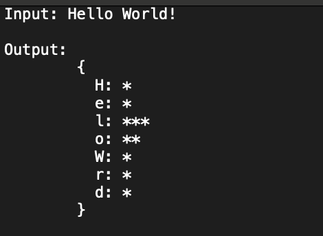

## Textogram - DEV

*Textogram*  is a command-line program written in JavaScript. This program takes in a user inputted phrase, and outputs an accurate histogram representing the number of words or character (depending on user preference). This assignment had pre-written tests to help us practice Test Driven Development and ensure our projects were meeting the technical requirements.

Example:
User elects to have a character based histogram

### Links
- [Textogram Pull Request](https://github.com/DevDegree/dev-textogram-scottzyang/pull/1) (Internal to Shopify/DevDegree Only)

### Technical Requirements/Iterations
This project had three different iterations, detailed below:
1. Display character-based histogram.
2. Display character-based histogram with special characters and case sensitivity options enabled.
3. Prompt user for their choice of character-based or word-based histogram, as well as special characters/case sensitivity options enabled.
> Note: Each iteration containeed their own tests to ensure technical requirements were being met.

### Learnings/Outcomes
- My knowledge of JavaScript was still very minimal at the time of starting this assignment, prior to this I had only learned how to define variables and often had to research how to declare functions. This project was completed using `Classes`, which were an entirely new concept to me. I couldn't wrap my mind around the significance of utilizing classes to complete this assignment, as everything we had done up to this point were completed with functions.
- One of the challenges I encountered had to do with passing in the correct arguments into the `Textogram Part 3` iteration. Based on the tests that were written, this iteration required passing in the user phrase as well as an object that contained all the user selected preferences - case sensitivity, special characters, word-based/character-based histogram, printing * or #. I initially tried passing all the user preferences in individually, and the tests kept failing. After reviewing the tests I determined that the best workaround was to prompt the user for their preferences, combine them into an object, and pass that into `Textogram Part 3`.
- Having the tests being written first really helped me understand the technical requirements further. Often times coding feels like a big black box. You know what is going in, and what comes out, but what happens in between is ambiguous. I knew what was going into this magic black box - the user inputted phrase. The pre-written tests showed me what output was expected out of this magic black box, and having that knowledge through Test Driven Development helped me scope out the contents of this magic black box cleanly.
- Biggest takeaway was learning how to abstract repeated code into reusable blocks. I initially had all my logic exist within the `updateTextogram` method, but then abstracted them all out into different methods. In my attempts to make my code more DRY, I realized that I used too many specific methods to achieve certain tasks, and each method only differed slightly thus making them non-reusable. For instance the `#caseSensitive()` method looks VERY similar to the `#notCaseSensitive()` method, only differing slightly with the control flow. Since each method was so specific to case sensitivity, I couldn't figure out how to combine them into one method for reusability.

## Reflection
- Overall, this assignment was actually quite difficult and a bit stressful. I was able to push through Part 1 very quick, and Part 2 with minimal hiccups. However, Part 3 threw me in for the biggest loop (ha no pun intended). I think I find the hardest part about coding so far has been, simply, getting started. I spend a lot of time staring at a blank code editor not knowing how to start because I get overwhelmed at the amount of logic I have to think through. It really helps to think the problem out pragmatically and take it apart piece by piece.
