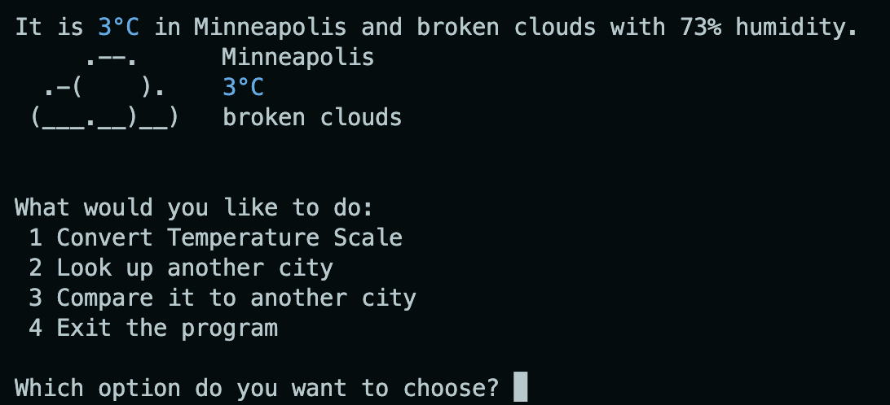

## Weather App - DEV
*Weather App* is a command-line program written in JavaScript and utilizes the [OpenWeather API](https://openweathermap.org/api) to receive real-time weather-related data based on user input. This program served as the final group project to end the DEV curriculum as part of the Training Path.

Example: User inputs "Minneapolis" as location.

### Noteworthy Responsibilities
- Develop the `while` loop within logic flow within the `main.js` file to handle user selected options.
- Develop the `comparecities` helper function to input two cities and compare weather data received from OpenWeather API.
- Create the `displayWeather()` method within the `weatherClass` file and debug associating issues. The display method shows the city weather data and needed to display either `Fahrenheit` or `Celsius` depending on the user input.
- Troubleshoot merge conflicts between group members.
